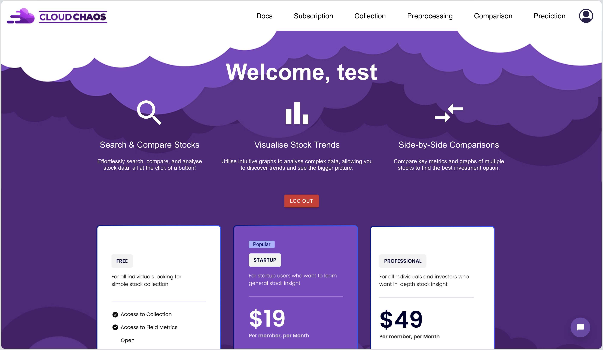
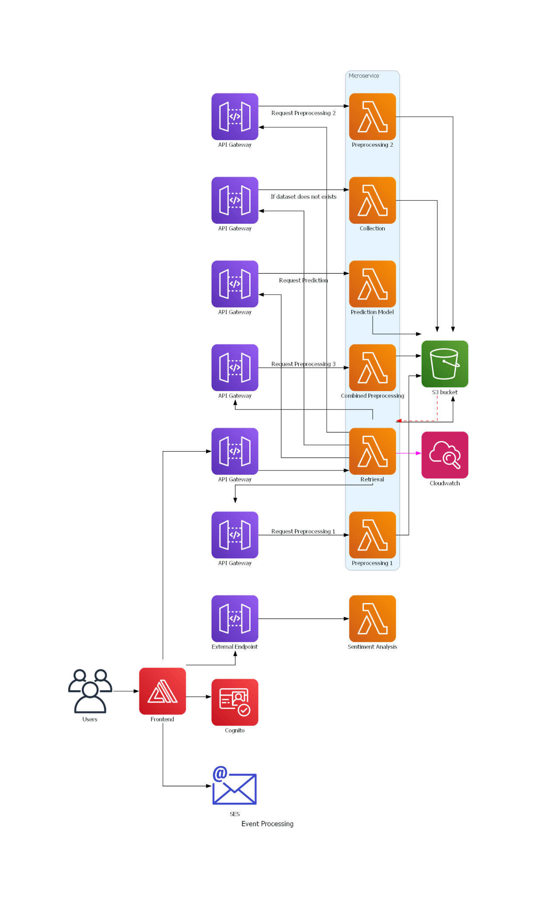

# CloudChaos - Stock Comparison Made Easy! 

Imagine a world where comparing stocks is effortless. Instead of spending hours comparing countless stocks, you can make informed investment decisions with a click of a button. That is what we aim for CloudChaos to be, your comprehensive stock analysis platform. It will cut out all the unnecessary information and present to the user only as much as they want to see. Comparisons will be able to be made visually with graphs and stocks can be compared side by side with an explanation for what the data indicates. Users will be able to create accounts and do all of this on an intuitive interface.

Watch a demo of the app's features in action 

## Structure 
This repository contains 2 folders, one for the backend and the other for the frontend. It was built in under 10 weeks and the reason I cannot show the original commits is because they are part of a private university GitHub organisation. 

#### Product Features Implemented 

- User Account Management
   - Sign Up & Account Creation: Enable users to easily sign up and create their own accounts.

- **Access to Documentation for developers** 
  - Used [Swagger](https://swagger.io/) to allow developers to read our [documentation](https://app.swaggerhub.com/apis-docs/SAMMRIDDHGUPTA/cloudchaos/1.0.0) and understand how our endpoints work, to enable them to use it for their own purposes.

- **Comprehensive Stock Metrics Analysis**
  - Data Collection: Collect and display stock metrics for any chosen stock within a specified date range in a clear and accessible tabular format.

  - Data Export: Allow users to download the collected data in JSON format.

- **Advanced Data Preprocessing**
  - Metric Calculation: Perform multi-level data preprocessing to derive additional metrics including daily percentage return, average daily price, price range, and moving averages for 7, 14, and 30 days.

  - Data Export: Enable users to download the processed data in JSON format.

- **Stock Comparison & Visualization**
  - Multiple Stock Comparison: Facilitate the comparison of an unlimited number of stocks.

  - Interactive Graphs: Provide visually appealing and interactive graphs, allowing users to toggle the visibility of each stock to better understand their trends.

- **Sentiment Analysis & News Integration** (Used another Team's API)
  - Stock Sentiment Analysis: Display sentiment analysis results for stocks, indicating positive, neutral, and negative sentiments.

  - News Integration: Provide access to news articles related to selected stocks to aid in understanding market influences. 

- **Stock Price Prediction for upto 1 year**
  - Machine learning microservice: we experimented with various prediction models like Linear Regression, SVM, Random Forest, XGBoost and ultimately found that linear regression performed the best relatively and incorporated that for predicting stock prices. 

  - Visualise the predicted data for better understanding of the trend.  

  - Data Export: Enable users to download the predicted data in JSON format.

#### Deployment
_Note that this was being deployed while the university was providing me access to AWS services for free, the AWS Amplify deployment link may no longer work if it's been shut down by the course department._ 

_This application was being continuously deployed at https://main.d332b7vcir4cg5.amplifyapp.com/ using AWS Amplify_

### Software Architecture Diagram - 
